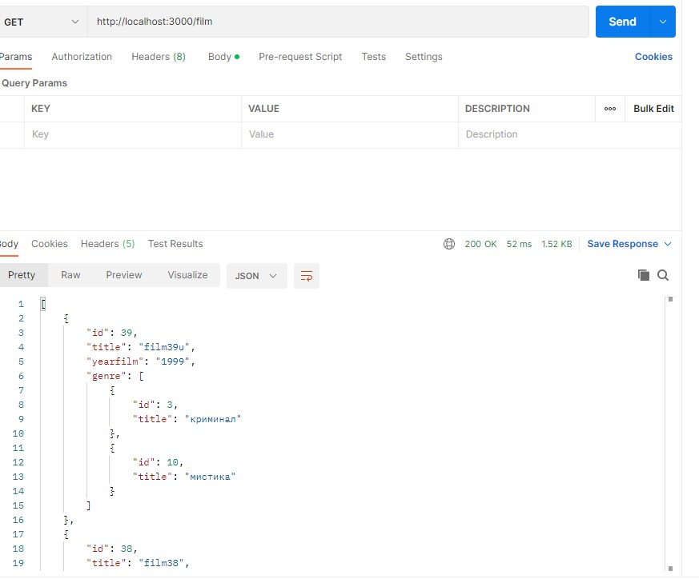
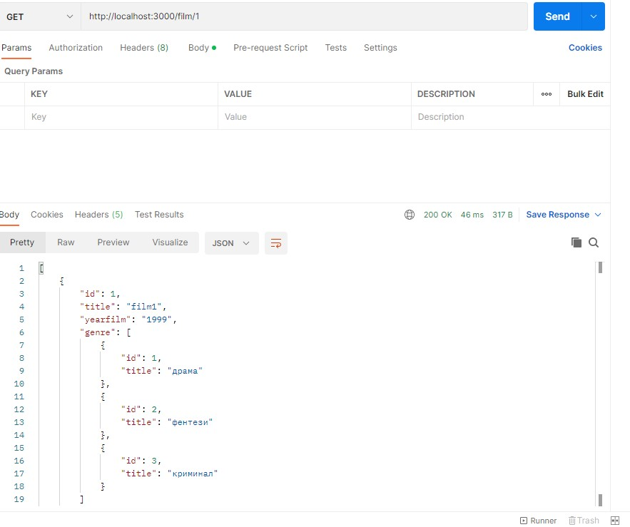
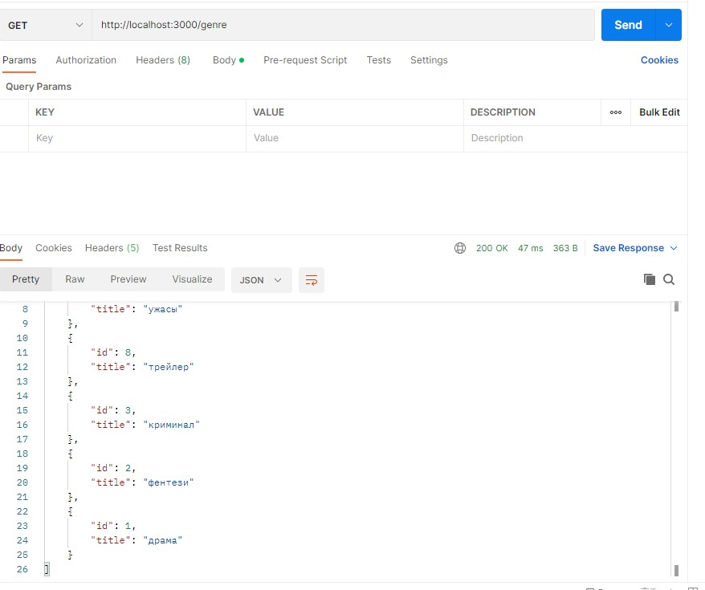

# CRUD server Node JS without frameworks

## endpoints:
- genre
  - genre method GET - get all genres
  - genre/id method GET - get one genre
  - genre method POST - post new genres
  - genre/id method PUT - update genre 
  - genre/id method DELETE - delete genre 
- film
  - film method GET - get all films
  - film/id method GET - get one film
  - film method POST - post new film
  - film/id method PUT - update film 
  - film/id method DELETE - delete film 

### screenshots

All films

One film

Get genres

